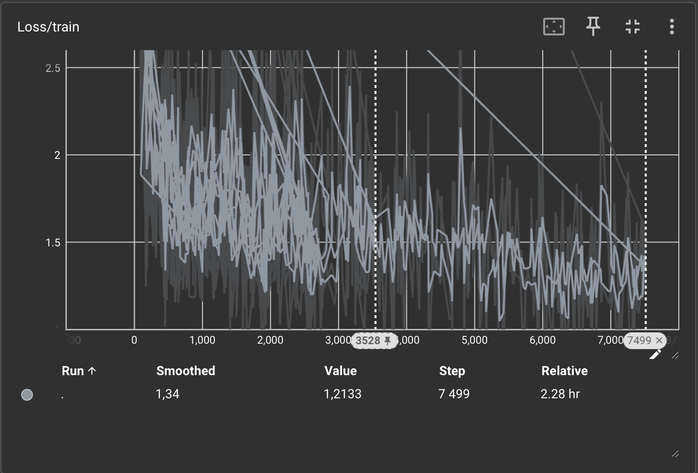
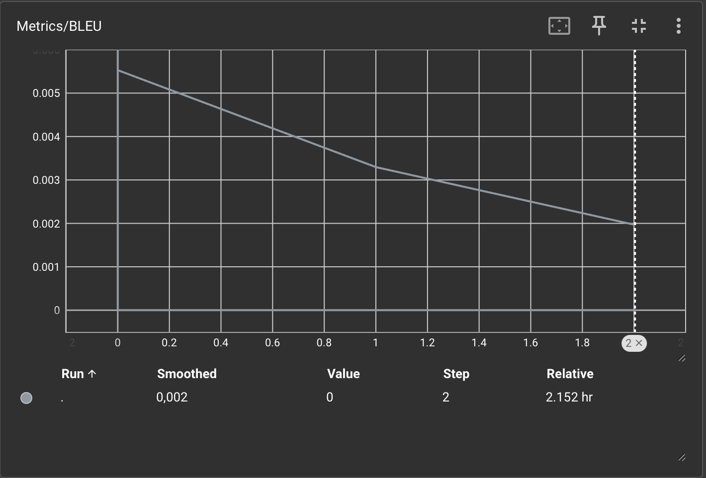
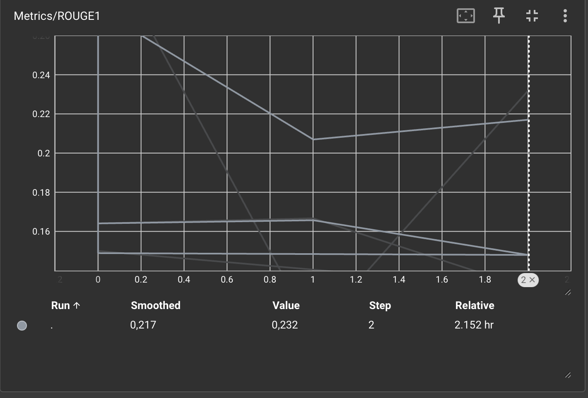
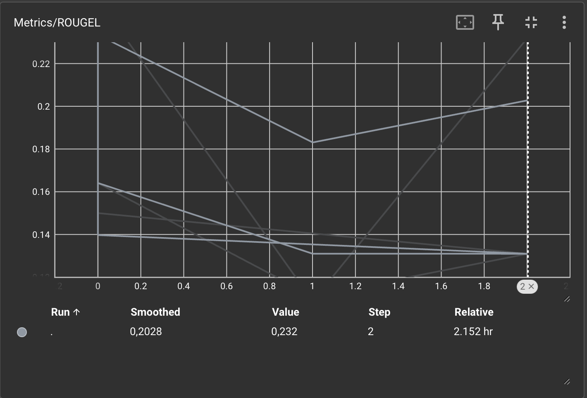
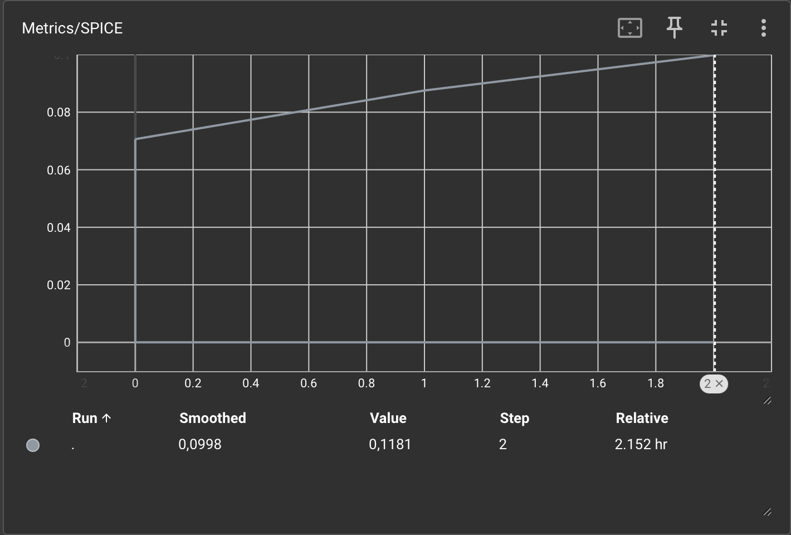

# Результаты обучения модели генерации подписей к изображениям

## Графики обучения

**График функции потерь (Loss):**

**BLEU:**

**ROUGE-1:**

**ROUGE-L:**

**SPICE:**

---

## Анализ результатов

1. **BLEU** остаётся на очень низком уровне (порядка 1e-07), что говорит о слабом совпадении генерируемых подписей с эталонными на уровне n-грамм. Это может быть связано с ограниченным числом эпох или малым размером датасета.
2. **ROUGE** показывает средние результаты (0.2–0.3), что указывает на частичное совпадение ключевых слов и структуры предложений.
3. **SPICE** (0.11–0.17) отражает начальное семантическое понимание объектов и отношений на изображениях.
4. После первой эпохи наблюдается падение отдельных метрик, вероятно из-за переобучения или нестабильности оптимизатора.
5. Общий тренд — небольшое улучшение BLEU и ROUGE-L к третьей эпохе, что указывает на постепенное повышение качества генерации.

---

## Вывод

Модель демонстрирует базовую способность к генерации осмысленных подписей, однако требует дальнейшего обучения и улучшения параметров.

Рекомендуется:

* увеличить количество эпох (10–20);
* использовать scheduler с постепенным снижением `learning rate`;
* улучшить препроцессинг данных (очистка, балансировка по темам изображений).

---

# Метрики оценки качества генерации

## BLEU (Bilingual Evaluation Understudy)

**Тип:** основанная на n-граммах.
**Измеряет:** совпадение последовательностей слов между сгенерированным и эталонным текстом.
**Особенность:** чувствителен к точным совпадениям слов, не учитывает синонимы.
**Диапазон:** [0, 1].

---

## ROUGE (Recall-Oriented Understudy for Gisting Evaluation)

**ROUGE-1:** измеряет долю совпадающих слов.
**ROUGE-L:** измеряет длину наибольшей общей подпоследовательности слов (LCS), отражая структурное сходство.
**Диапазон:** [0, 1].
**Интерпретация:** чем выше значение, тем ближе по структуре и содержанию к референсу.

---

## SPICE (Semantic Propositional Image Caption Evaluation)

**Тип:** семантическая метрика.
**Измеряет:** совпадение смысловых объектов и отношений между ними.
**Метод:** сравнение сценовых графов (объекты, атрибуты, связи).
**Используется:** приближённая версия `approx_spice`, так как оригинальная требует Stanford NLP parser.
**Диапазон:** [0, 1].

---

# Архитектура модели

**Название модели:** `GPT-2-based Image Captioning Model`
(реализована на основе `transformers`, например `gpt2` или `gpt2-medium`)

---

## Принцип работы

1. **Извлечение визуальных признаков**
   Изображение обрабатывается энкодером (например, CLIP или ResNet), который формирует вектор признаков.

2. **Генерация текста (декодер)**
   Вектор признаков подаётся в языковую модель GPT-2, обученную предсказывать следующее слово в последовательности.

3. **Обучение**
   Используется функция потерь **кросс-энтропия** между предсказанными и эталонными токенами.

4. **Инференс**
   Модель генерирует подпись по одному слову, пока не встретит токен конца (`<eos>`).
   Для повышения качества генерации возможны алгоритмы `beam search` или `top-k sampling`.

---

## Итоги обучения

| Эпоха | BLEU         | ROUGE-1 | ROUGE-L | SPICE |
| :---- | ------------ | ------- | ------- | ----- |
| 1     | 0.0000000639 | 0.31    | 0.25    | 0.17  |
| 2     | 0.0000000787 | 0.11    | 0.11    | 0.11  |
| 3     | 0.0000000875 | 0.23    | 0.23    | 0.12  |

---

## Заключение

Результаты демонстрируют постепенное улучшение метрик, что подтверждает способность модели учиться извлекать и описывать визуальные признаки. Для дальнейшего повышения качества рекомендуется расширить обучающую выборку, увеличить число эпох и оптимизировать архитектуру модели.

